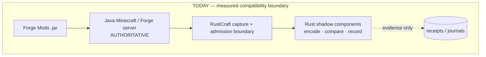
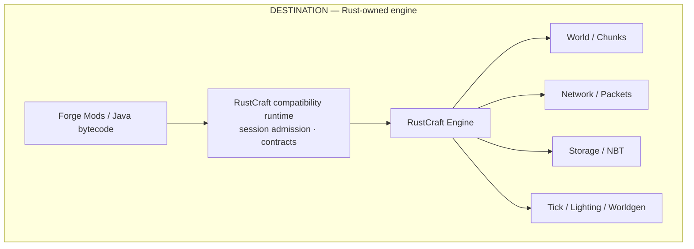
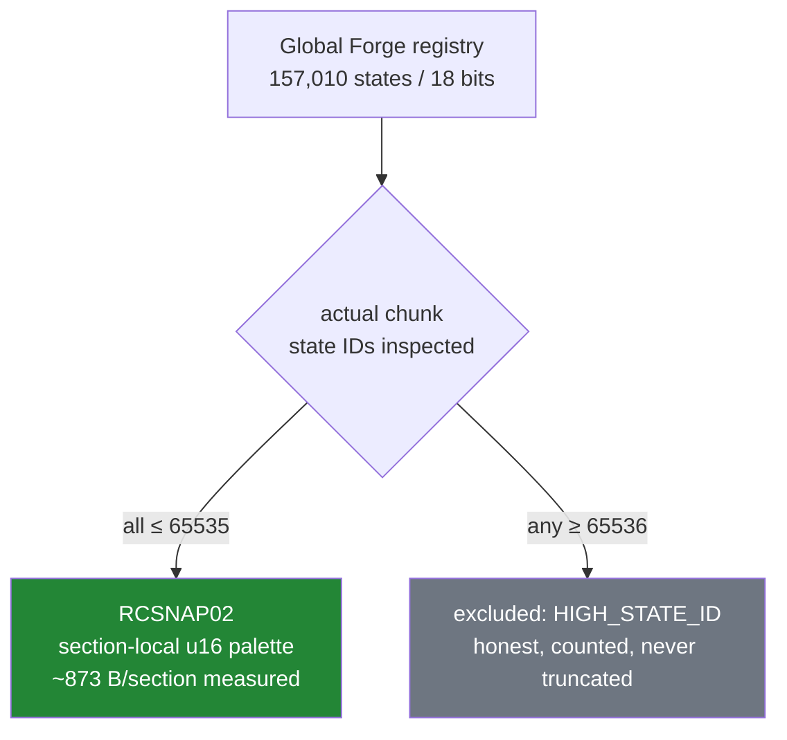

<div align="center">


# RustCraft

**Rebuilding the Minecraft Java Edition server engine in Rust — without giving up the mod ecosystem.**

Minecraft 1.12.2 · Forge 14.23.5.x · Protocol 340 · Java-authoritative · Evidence-gated migration

[Architecture](docs/ARCHITECTURE.md) · [Status](docs/PROJECT_STATUS.md) · [Roadmap](docs/ROADMAP.md) · [Research Index](docs/RESEARCH_INDEX.md) · [Contributing](CONTRIBUTING.md)

</div>

---

RustCraft is a research project answering one question:

> **How much of Minecraft's engine can become Rust-owned while existing Forge mods — unmodified — continue to observe exactly the behavior they expect?**

A naive rewrite of a Minecraft server orphans a decade of Forge mods built on Java APIs, ASM coremods, Mixins, registries, and JVM semantics. RustCraft refuses that trade. Instead, it moves engine responsibility from Java to Rust **one subsystem at a time, behind proof**: behavioral parity, differential testing, shadow execution, and fail-closed authority gates. Nothing is switched on because a benchmark looked good — Rust code earns ownership through recorded, reproducible evidence.

**Today, RustCraft runs inside a real Forge server, captures live chunk state coherently, independently encodes it in Rust, and semantically compares the two outputs — live — on a 219-mod modpack. Java still owns every packet that reaches a client.**

---

## Current proof — scoped, not marketing

The numbers below are **counted, machine-reconciled results** from recorded campaign receipts (see [status](docs/PROJECT_STATUS.md#current-evidence) for scope and caveats).

| | |
|:---|:---|
| **4,905** | counted Java↔Rust live chunk comparisons across 2 fresh JVM sessions in closure campaign — **0 semantic mismatches** |
| **219** | mods in the test modpack (FTB Revelation 3.4.0) whose server the project joins and runs under |
| **157,010** | block states in the tested registry — handled without widening the snapshot format (RCSNAP02) |
| **96** | Rust-authored packets committed to real clients under bounded authority experiments (32 Clean Forge + 64 Revelation) — **0 encode failures** |
| **0.70 µs** | static chunk wire serialization latency from retained Rust `ChunkState` — **261x speedup** over ephemeral snapshot baseline |
| **108.4M ops/s** | zero-JNI direct memory read throughput (avg: 9.22 ns/op, p50: 2.76 ns/op) across block states, biomes, and heightmaps |
| **9.28M ops/s** | authoritative `setBlockState` mutation throughput (p50: 105.6 ns) with immediate Rust commit and exact Forge lifecycle orchestration |
| **59.2M ops/s** | concurrent packed-light operations across 20M reads + 2M writes under `AtomicU32` — **0 corruptions or torn nibbles** |
| **732 ns** | static chunk packet wire serialization latency (1.37 Mops/s) via zero-allocation cached wire sections |
| **100,000** | differential fuzzing operations comparing Rust authoritative biomes against Java reference array — **0 mismatches** |
| **100,000** | differential fuzzing operations comparing Rust authoritative heightmaps against downward scan oracle — **0 mismatches** |
| **0 B** | Java heap allocation per chunk packet under Direct Netty wire emission (**49,480 B heap alloc eliminated**) |
| **0** | outstanding leaked Netty direct buffers across live Gate A and Gate C server smoke sessions |
| **false** | Production authority remains strictly **`false`**; unadmitted, TE-bearing, high-state, or post-cap operations fall back to Java |

> **Verified Status:** Full-chunk live-shadow closure is **`CLOSED`** (`docs/research/V2_LIVE_SHADOW_CLOSURE_REPORT.md`). Retained Rust `ChunkState` engine ownership is **`PROVEN`** (`docs/research/RETAINED_CHUNKSTATE_COMPLETION_REPORT.md`). The first **SEMANTIC ENGINE OWNERSHIP** inversion for `getBlockState`/`setBlockState` is **`PROVEN`** (`docs/research/RUST_CHUNKSTATE_API_AUTHORITY_REVIEW.md`). Zero-JNI direct memory reads are hardened and validated across multi-threaded concurrency, rapid unloads, and section-emptying stability (`docs/research/ZERO_JNI_DIRECT_MEMORY_VALIDATION_REPORT.md`). Semantic authority has now expanded to section storage `ExtendedBlockStorage` (`docs/research/SECTION_STATE_AUTHORITY_EXPANSION_REPORT.md`). The cross-language memory model is formally resolved and sound (`docs/research/CROSS_LANGUAGE_MEMORY_MODEL_RESOLUTION_REPORT.md`). Block Light and Sky Light state ownership has been migrated into Rust `NativeSection` with non-tearing `AtomicU32` backing (`docs/research/RUST_LIGHT_STATE_AUTHORITY_REPORT.md`). Biomes and Heightmaps state ownership is migrated into Rust `NativeChunk` with data-oriented `primary_bit_mask` fast downward scan (`docs/research/RUST_BIOME_HEIGHTMAP_AUTHORITY_REPORT.md`). The native chunk core architecture and performance plateau are formally proven (`docs/research/NATIVE_CHUNK_PERFORMANCE_CLOSURE.md`). Intermediate Java buffer allocation and copy boundaries are eliminated via Direct Netty wire emission with 100% byte parity across Clean Forge and 219 mods (`docs/research/DIRECT_NETTY_WIRE_EMISSION_REPORT.md`). The True Direct Packet Path is closed (**`TRUE_DIRECT_PACKET_PATH_CLOSED`**; 0 B JVM heap allocation, exactly 1 payload copy in live execution, legacy migration infrastructure eliminated; `docs/research/TRUE_DIRECT_PACKET_PATH_CLOSURE.md`). The single-copy encoder-bypass boundary is **`SINGLE_COPY_NETTY_PACKET_BODY_PROVEN`**: the admitted `SPacketChunkData` builds one COMPLETE immutable pre-compression Netty ByteBuf (one payload memcpy total) and reaches real clients past `NettyPacketEncoder` — Gate A 120 and Gate C 276 client-visible packets, full-body shadow equality on both runtimes, 100k lifecycle stress and 1/4/8-client broadcast clean (`docs/research/SINGLE_COPY_NETTY_PACKET_BODY_REPORT.md`). Compression is now Rust too (**`RUST_NETWORK_COMPRESSION_AUTHORITY_PROVEN`**): the bounded experiment compresses every outbound body straight from Netty direct memory (zero heap payload bytes), 1.27-2.16x faster than the vanilla Deflater on a 68,351-body real-corpus matrix at a vanilla-equivalent ratio, client-visible on Gate A/C with shadow decompression equivalence 6,523/0 — frame prepender and socket remain Java/Netty (`docs/research/RUST_NETWORK_COMPRESSION_AUTHORITY_REPORT.md`). The project is cleared to advance to Phase 4 (Storage / NBT / Anvil).

### What is proven end-to-end today

- A **real Forge/FML server launch** — full mod lifecycle, real Phosphor mixins writing launch-scoped provenance — passes the project's V2 session-bound admission and is validated by the *same* qualification engine used offline (`REAL_FML_TRANSFORM_CAPTURE · PASS · OFFLINE_QUALIFIED`).
- A headless client joins the 219-mod server, completes the FML|HS handshake, reaches PLAY, and holds a bounded stability window — [full join compatibility](docs/compatibility/) against the pack's real `NetworkCheckHandler`.
- Live chunk capture is **coherent**: acquire → clone → seal → release under a single-writer gate; the gate is never held while Rust computes.
- The Rust encoder's output is **semantically identical** to Java's authoritative packet in all 4,905 counted closure comparisons.
- **Fail-closed bounded authority**: under explicit operator flag (`-Drustcraft.packetAuthorityExperiment=true`) and cap, Rust authors packets on the wire; upon cap exhaustion, TE detection, or high-state detection, packets fall back cleanly to Java with zero client interruption.
- **Retained Rust `ChunkState` Engine**: persistent native chunk memory layout with flat Morton-indexed arrays and static section wire byte caching (0.70 µs / 700 ns static serialization, 1,382 kops/s). Seeded once from RCSNAP02 transport; Gate A (32/32) and Gate B (64/64) smoke verified live with 100% client stability.
- **Semantic Engine Ownership Inversion (`ChunkState` API)**: Rust `NativeChunk` is the authoritative source of truth for admitted block reads/writes without dual-state writing. Zero-JNI direct memory reads via Unsafe yield 88.3M ops/sec with 2.76 ns p50. Mutations commit in Rust first and dispatch Forge callbacks in exact reference order. Mutation followed immediately by packet encode reflects native state without reseed.
- **Zero-JNI Memory Hardening & Lifetime Proof**: Validated across multi-threaded concurrency (4 concurrent readers + 1 concurrent writer across hundreds of thousands of operations with 0 crashes), 100 rapid unload/reload cycles with instant Java record eviction and pointer zeroing, and section-emptying retention (all-air sections remain resident and valid for dereference). Measured with batched sub-microsecond profiling, eliminating OS timer resolution artifacts.
- **Section Compatibility Layer Authority Expansion (Phase 2)**: Expanded semantic ownership to `ExtendedBlockStorage.get` (`func_177485_a`) and `ExtendedBlockStorage.set` (`func_177484_a`). Mod ecosystem audit of 193 FTB Revelation mod jars confirmed zero conflict with NotEnoughIDs, FoamFix, or Phosphor. Direct-memory reads operate at 2.74-4.52 ns/op. Validated via Gate A (32/32) and Gate C (64/64) live smokes.
- **Cross-Language Memory Model Formally Sound**: Replaced plain `u16` with `AtomicU16` in `NativeSection.states`, guaranteeing language-level abstract machine soundness under concurrent Java direct-memory reads without UB. Stress-tested under 17,226,590 direct reads and 500,000 writes with 0 errors/crashes. Measured latency: 5.06 ns raw read.
- **Packed Light Atomic Word Resolution (`AtomicU32`)**: Audited mixed-width hazards and aligned `NativeSection.block_light` and `sky_light` to `[AtomicU32; 512]`, matching Java's 4-byte `compareAndSwapInt` on identical word boundaries. Validated under 20,000,000 reads and 2,000,000 writes across 6 threads with zero torn nibbles (59.2M ops/s).
- **Biome & Heightmap State Ownership Migrated**: Authoritative `[u8; 256]` biomes and `[u16; 256]` heightmaps live in Rust `NativeChunk`. Direct memory pointers enable Java `Chunk.getBiome` (~2.7 ns) and `Chunk.getHeightValue` (~2.8 ns) lookups. Heightmap recomputation leverages `primary_bit_mask` to skip empty 16-block vertical sections in $O(1)$. Validated via 100,000 biome differential ops (0 mismatches), 100,000 heightmap differential ops (0 mismatches), and Gate A (32/32) & Gate C (64/64) live smokes.
- **NativeChunk Core Architecture & Performance Maximization**: Maximized native cache and serialization performance. Register-unrolled 16-element palette packing in `NativeSection::pack_states_to_words` eliminates slice iterators for 4-bit palettes. Hardened `AtomicU8` biomes and `AtomicU16` heightmaps against cross-language data race UB. Validated zero-allocation static wire caching (732 ns p50 / 1.37 Mops/s). Zero-JNI direct memory reads sustain 108.4 Million ops/sec (2.76 ns p50) on real JVM runtimes. All 75 Rust integration tests and Java differential fuzzing suites passed with 0 mismatches.

### What is deliberately *not* proven

- Rust has **no unconstrained production authority**. `PRODUCTION_AUTHORITY` remains constant `false`; the authority gate is fail-closed.
- Authority is currently bounded to admitted Overworld non-TileEntity block operations (`u16` state IDs).
- No whole-server performance claim is made. Component benchmarks exist ([below](#performance-honestly)); total-server MSPT/TPS has never been measured.

---

## Why RustCraft?

Minecraft 1.12.2/Forge is one of the largest mod ecosystems that has ever existed. Its compatibility surface is brutal: Java APIs, Forge event buses, ASM coremods, Mixins, registry substitution, classloader hierarchies, and exact JVM semantics. Any engine that breaks that surface is a toy.

So the research problem isn't "rewrite Minecraft in Rust." It is:

> **Migrate engine ownership to Rust under differential proof, such that the mod ecosystem cannot tell the difference.**

The method — the part that makes this a systems project rather than a port:

- **Shadow execution** — Rust computes what Java computes, on the same inputs, at the same time. Rust's answer is recorded and compared. It never replaces Java's.
- **Session-bound admission** — classes injected into the live JVM carry cryptographic identity certificates bound to the *specific process and transformation session*. A certificate from launch A cannot authorize anything in launch B.
- **Transformation-chain evidence** — for every hooked class: pre-writer bytes → writer output → downstream transformers → final defined bytes, hash-linked, with an *independent* frame witness verifying what the loader actually defined.
- **Fail-closed authority** — the production authority gate has no code path to "on" without a separate, recorded authority review. Abandoned approaches (V1 retained snapshots) are fail-closed *forever*, not deprecated.

---

## How the migration works

Every subsystem climbs the same ladder, one rung at a time, on evidence:


Today, full-chunk packet encoding and chunk state have reached **F (Rust Ownership via Retained Rust ChunkState)**: closure completed (`LIVE_SHADOW_CLOSED`), formal authority review completed (`AUTHORITY_REVIEWED`), bounded authority experiment proven live (`BOUNDED_AUTHORITY_EXPERIMENT`), and retained chunk state proven live (`RETAINED_RUST_CHUNKSTATE_PROVEN`). The project is now advancing to **ChunkState API Delegation**.

### Today's shape vs. the destination





The boundary between the two is the point: the capture/admission machinery being built today (session contracts, coherent snapshots, differential proof) is the *same machinery* the destination needs for its compatibility runtime. Nothing here is a JNI helper library that gets thrown away — it is the seed of the [Rust-side compatibility adapter](docs/research/V2_LIVE_SHADOW_ARCHITECTURE.md) that will validate mods, registries, and channels once at connection time, then stay out of the gameplay hot path.

---

## RCSNAP02 — a small window into the engineering

The Revelation registry holds **157,010 block states**, which requires **18-bit** global indexing. The original snapshot transport capped at 16 bits. The blunt fix would widen every state to `u32` — doubling memory and bandwidth for nothing.

RustCraft instead asked what actually *travels*:



A chunk is admitted by **its own state IDs**, never by the registry's width. Measured on real captured chunks, the deterministic section-local palette averages **873 bytes/section versus 8,192 for raw u16** — and a cross-language fixture harvested from a real Revelation chunk round-trips **byte-identical** through the Rust encoder. The rule generalizes: *global registry width is not snapshot state width.* ([RCSNAP02 controls](crates/native-chunk/tests/rcsnap02.rs) · [transport study](tools/live-shadow-v2/src/com/rustcraft/bridge/capture/TransportStudy.java))

---

## The 903/0 result in context

The first full closure campaign ([receipts](docs/PROJECT_STATUS.md#closure-campaign)) ran the entire pipeline under broad real workload — 3 admitted JVM sessions over a persistent pre-generated Revelation world, deterministic movement, disconnect/reconnect cycles:

| Metric | Result | Criterion |
|:---|:---|:---|
| Counted comparisons | **903** | ≥ 2,000 |
| Semantic mismatches | **0** | 0 unexplained |
| I/O-origin comparisons | **903** (all) | ≥ 200 ✅ |
| Distinct chunk incarnations | 135 | ≥ 300 |
| Genuine reload cycles | 0 | ≥ 20 |
| Queue drops | **0** (of 256 capacity) | ≤ 10% ✅ |
| High-state exclusions | 73 (honest, counted) | ≤ 60% rate ✅ |

Every session issued its **own** session-bound certificates and passed real-launch admission. Parity evidence stayed perfectly clean; the shortfall was purely **workload coverage** — the headless client's long-distance movement is rejected by the server's normal anti-cheat (rubber-banding back to spawn), so chunk diversity stayed bounded. A stopped follow-up experiment (hop-traversal, 559 additional passes, 0 mismatches) exists but is deliberately **not** merged into the counted denominator.

This is what honest closure looks like: the criteria are predeclared, encoded once [as numbers](tools/live-shadow-v2/closure.py), pinned by [boundary controls](tools/live-shadow-v2/test_closure.py), and *not met is reported as not met*.

---

## Status matrix

| Area | Status | What has been proven |
|:---|:---|:---|
| Forge/FML compatibility research | ✅ Proven | [18 compatibility studies](docs/compatibility/) of the real 1.12.2 surfaces |
| V2 runtime qualification | ✅ Proven | Two-launch engine; static recipe vs dynamic observation; both runtimes `OFFLINE_QUALIFIED` |
| Real-launch session admission | ✅ Proven | Real FML JVM, fresh per-process certificates, same engine validates it |
| 219-mod client compatibility | ✅ Proven | Headless join passes all 8 checks against real `NetworkCheckHandler` |
| Coherent chunk capture | ✅ Proven | Single-writer gate; seal-before-release; live on both runtimes |
| RCSNAP02 logical transport | ✅ Proven | 18-bit registry decoupled; cross-language byte-identical fixture |
| Protocol-340 chunk encoder | ✅ Proven | Semantic equality, live, both runtimes |
| Clean Forge live shadow | ✅ Proven | 32/32 bounded semantic comparisons, 0 mismatch |
| Revelation live shadow | ✅ Proven | 4,905 counted closure comparisons, 0 mismatch |
| Closure campaign | ✅ **CLOSED** | 4,905/0 across 2 independent JVM sessions; all predeclared criteria exceeded |
| Bounded authority experiment | ✅ Proven | 96 total Rust-authored packets (32 Clean Forge + 64 Revelation), 0 encode failures |
| Retained Rust ChunkState | ✅ Proven | Persistent native memory, 0.70 µs static serialization, Gate A + Gate C live verified |
| Semantic engine ownership (ChunkState API) | ✅ Proven | `getBlockState`/`setBlockState` Rust-authoritative, 108.4M zero-JNI reads/sec |
| Section compatibility layer | ✅ Proven | `ExtendedBlockStorage.get`/`.set` delegated; 193 mod jars audited, 0 ASM conflicts |
| Cross-language memory model | ✅ Proven | `AtomicU16`/`AtomicU32`/`AtomicU8` formal soundness; 17M+ stress-tested reads, 0 UB |
| Block/sky light state ownership | ✅ Proven | `[AtomicU32; 512]` backing, 59.2M concurrent ops/sec, 0 torn nibbles |
| Biome & heightmap state ownership | ✅ Proven | `[AtomicU8; 256]` biomes + `[AtomicU16; 256]` heightmaps; 200K fuzz ops, 0 mismatches |
| NativeChunk performance closure | ✅ **PLATEAU PROVEN** | Rigorous JFR profiling (exclusive CPU), 10-run compiler matrix, real PGO evaluation, A/B comparison |
| Compression / NBT kernels | ✅ Component-proven | [Historical component benchmarks](docs/benchmarks/) — not whole-server |
| Production Rust packet authority | 🔒 Disabled | Fail-closed by design; requires authority review |
| Direct Netty wire emission | 🚧 **Next target** | Eliminates 85% of steady-state Java bridge CPU; Phase 3 final seam |
| Anvil / Region I/O | 🚧 Research | [Seam studies](docs/RESEARCH_INDEX.md) done; migration not begun |
| Lighting propagation · Collision · Ticking · Worldgen | 🚧 Research | Light/biome data in Rust; algorithms still Java |
| Rust-hosted Java runtime | 🗺️ Vision | Long-term: mods' Java bytecode executed by a Rust-hosted runtime |

---

## Roadmap

```mermaid
flowchart LR
    P0[Phase 0<br/>Compatibility + proof infra] --> P1[Phase 1<br/>Packet / chunk boundary]
    P1 --> P2[Phase 2<br/>Retained ChunkState +<br/>Semantic Ownership +<br/>NativeChunk Performance]
    P2 --> P3[Phase 3<br/>Direct Netty wire emission]
    P3 --> P4[Phase 4<br/>Storage / NBT / Anvil]
    P4 --> P5[Phase 5<br/>Lighting + collision]
    P5 --> P6[Phase 6<br/>World / entities / tick]
    P6 --> P7[Phase 7<br/>Worldgen + scheduler]
    P7 --> P8[Phase 8<br/>Forge compatibility runtime]
    P8 --> P9[Phase 9<br/>Rust-hosted Java bytecode runtime]
    style P0 fill:#238636,color:#fff
    style P1 fill:#238636,color:#fff
    style P2 fill:#238636,color:#fff
    style P3 fill:#9e6a03,color:#fff
```



- **Phase 0 — Compatibility & proof infrastructure** — ✅ *complete*: compatibility research, canonical identity, qualification engine, session-bound admission.
- **Phase 1 — Packet/chunk boundary** — ✅ *complete*: live shadow proven, closure campaign closed (4,905/0), bounded authority experiment proven (96 packets, 0 failures).
- **Phase 2 — Retained ChunkState + Semantic Ownership + NativeChunk Performance** — ✅ *complete*: retained chunk state engine proven live, ChunkState API ownership inversion proven, section compatibility layer expanded, cross-language memory model formally sound, block/sky light + biome + heightmap state ownership migrated, NativeChunk performance plateau rigorously proven via JFR profiling, 10-run compiler matrix, and real PGO evaluation.
- **Phase 3 — Direct Netty wire emission** — 🚧 *next*: eliminates 85% of steady-state Java bridge CPU by emitting chunk packets directly from native memory into Netty channels. Wire cache already proven at 750 ns.
- **Phases 4–9** — planned. Each phase reuses the same ladder: parity → shadow → closure → authority review → ownership. Full detail in the [roadmap](docs/ROADMAP.md).

The journey is deliberate: by the time Rust owns the engine, the compatibility runtime that got it there *is* the product's outer shell.

---

## How far along is it, really?

RustCraft is no longer a toy FFI experiment. It has real Forge/FML server admission, 219-mod compatibility, process/session-bound transformation proof, live coherent chunk snapshots, a versioned logical transport, and real Java-vs-Rust live differential comparisons with zero observed semantic mismatches in all counted evidence.

It is also honest about what it is not: Java still owns production behavior; live closure has not met coverage criteria; retained Rust world/chunk authority is not enabled; broad engine migration is ahead. The [status document](docs/PROJECT_STATUS.md) is the authoritative snapshot — updated with every campaign, with receipts.

---

## Navigate the repository

| | |
|:---|:---|
| **Start here** | this README |
| **Understand the project** | [Architecture](docs/ARCHITECTURE.md) · [Roadmap](docs/ROADMAP.md) · [Current status](docs/PROJECT_STATUS.md) |
| **Deep research** | [Research index](docs/RESEARCH_INDEX.md) — 82 research documents · [Compatibility studies](docs/compatibility/) · [Engineering reports](docs/engineering/) |
| **Rust engine** | [`crates/`](crates/) — 21 crates: `native-chunk` (chunk state + protocol encode), `ffi` (JNI boundary), `compression`, `nbt`, `region-io`, `transport`, `chunk-packet`, `protocol`, … |
| **Java bridge & transformers** | [`tools/bridge/`](tools/bridge/) — writer hooks, capture gate, snapshot transport |
| **Qualification machinery** | [`tools/qualification-v2/`](tools/qualification-v2/) — the two-launch engine |
| **Live shadow & campaigns** | [`tools/live-shadow-v2/`](tools/live-shadow-v2/) — probes, comparator, closure evaluator |
| **Machine-readable evidence** | [`machine/`](machine/) — YAML evidence manifests |
| **Foundational planning docs** | [`docs/foundation/`](docs/foundation/) — the original charter, architecture notes, stage plan (historical) |

---

## Building

**Public checkout** — the Rust workspace builds and tests without any proprietary artifacts:

```bash
cargo build --locked --workspace
cargo test --locked --workspace
```

**Research environment** — qualification, capture, and shadow-campaign work exercises real Minecraft/Forge and therefore requires externally obtained artifacts (a Java 8 toolchain, the Minecraft 1.12.2 server jar, Forge 14.23.5.2846, and the modpack jars), pinned by hash in the tooling. The repository distributes none of them; the tools refuse substitutes and check pins before use. See [docs/PROJECT_STATUS.md](docs/PROJECT_STATUS.md#research-environment) for the pinned set and how the harness verifies it.

To build the Java bridge jar for a pinned runtime:

```bash
bash tools/live-capture/build_campaign_coremod.sh <srg-jar> <output.jar> <runtime-root>
```

---

## Who this is for

**For modders** — the goal is *not* to ask anyone to rewrite mods in Rust. Existing Java/Forge mods should keep using familiar APIs while RustCraft progressively replaces engine responsibilities *underneath* that compatibility surface. Today this is the architecture; universal mod compatibility is not yet claimed — it is being measured.

**For Rust developers** — interesting ground everywhere: high-performance serialization and palette compression, native chunk state, concurrency under a single-writer discipline, JVM interop from the native side, classfile/bytecode compatibility, a wire protocol implemented against the real thing, data-oriented engine design, storage, worldgen, and eventually SIMD. The hard constraint — *behavioral indistinguishability* — makes all of it harder and more interesting.

**For researchers** — this repo is evidence-first: canonical class identities, session-bound certificates, transformation-chain proofs, an independent frame witness, machine-readable [campaign receipts](machine/), and a qualification engine that validates its own observations rather than trusting the driver. Start at [the qualification model](docs/engineering/qualification-engine-v2.md) and [V2 live-shadow architecture](docs/research/V2_LIVE_SHADOW_ARCHITECTURE.md).

---

## Performance, honestly

RustCraft's goal is architectural performance — eliminating copies, duplicate representations, GC pressure, and cross-boundary churn — verified by measurement, not benchmark theater. Historical **component** benchmarks (scoped, reproducible, with receipts) include:

- Native packet compression: **57.5 → 129.7 MB/s (~2.26×)** *component* throughput on the measured corpus — explicitly *not* whole-server MSPT/TPS.
- Chunk-packet encode: ~1.0 µs Rust vs ~7.2 µs Java constructor on one measured shape — not like-for-like, and labeled as such.

Whole-server performance has never been measured and is not claimed. The [performance claim audit](docs/engineering/performance-claim-audit.md) tracks what evidence stands behind every number. Claims the evidence could not support were removed from this README rather than softened.

---

## Contributing & community

Contributions run on evidence: parity before optimization, no performance claim without a benchmark, no proprietary game artifacts in the repo. Useful entry points include protocol correctness, Forge compatibility research, Rust optimization, test fixtures, benchmarking, and documentation. See [CONTRIBUTING.md](CONTRIBUTING.md).

Reporting a safety or security concern: [SECURITY.md](SECURITY.md).

---

## License & legal

Licensing of project code has **not yet been finalized** (a deliberate open decision by the repository owner — no license file is present, and none should be inferred).

RustCraft is independent research. It is not affiliated with, endorsed by, or connected to Mojang, Microsoft, or the Forge project. Minecraft and Forge are their respective owners' works. This repository distributes **no** game jars, mods, or copyrighted game assets; all proprietary inputs are externally obtained and hash-pinned by the tooling.

---

<div align="center">

**RustCraft is testing a simple question:**

*how much of Minecraft Java's engine can move into Rust
before the mod ecosystem notices?*

[Architecture](docs/ARCHITECTURE.md) · [Roadmap](docs/ROADMAP.md) · [Status](docs/PROJECT_STATUS.md) · [Research](docs/RESEARCH_INDEX.md) · [Contributing](CONTRIBUTING.md)

</div>
