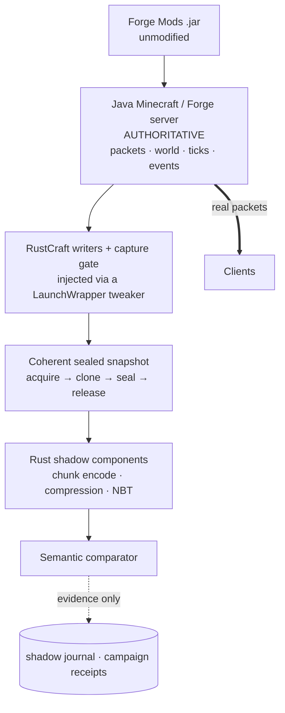
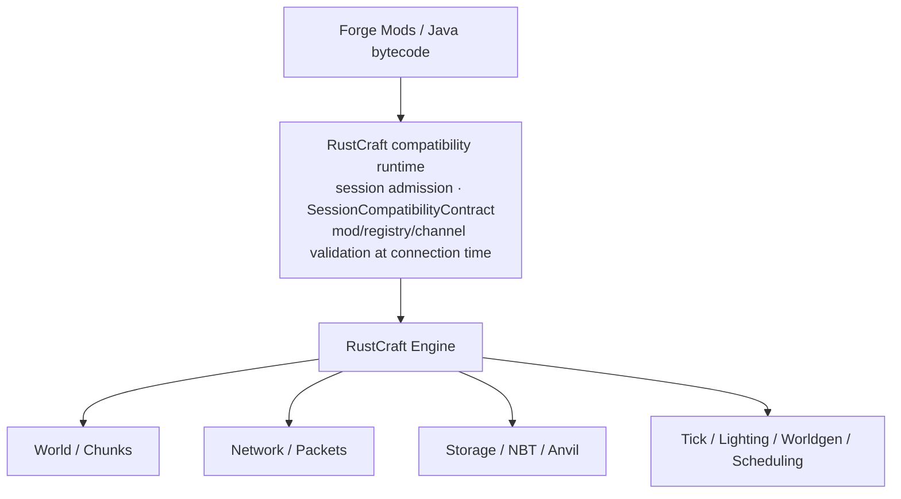

# Architecture

Public overview of how RustCraft is built and why. For the deep research trail, see the [research index](RESEARCH_INDEX.md); for the original planning documents, see [docs/foundation/](foundation/).

## The one-paragraph version

RustCraft is a Rust-owned Minecraft engine *behind* a Java/Forge compatibility shell. Today the shell is a real, unmodified Forge 1.12.2 server; Rust components live underneath it as shadow implementations whose output is compared — never substituted — against Java's authoritative output. Every Rust component earns ownership through a recorded evidence chain (parity → shadow → closure → authority review). The capture, admission, and comparison machinery being proven today is the same machinery the destination needs for its compatibility runtime.

## The two shapes

### Today: measured compatibility boundary

Key properties:

- **Java is authoritative.** Every packet a client receives is Java's. Rust output is recorded and discarded.
- **The capture is coherent.** Chunks are cloned under a single-writer gate; the gate is released before any Rust computation, so shadow work never blocks or observes torn state.
- **Admission is session-bound.** Injected classes carry identity certificates bound to the specific process and transformation session, with the full pre-writer → writer → downstream → final-defined chain hash-verified plus an independent frame witness.
- **Authority is fail-closed.** There is no code path to Rust production authority without a separate recorded review. The abandoned V1 retained-snapshot path returns `null` permanently.

### Destination: Rust-owned engine

The long-term shape (from the [foundation architecture note](foundation/02_ARCHITECTURE.md), refined by the V2 work):

- A **control-plane compatibility runtime** performs Forge/protocol negotiation, mod-inventory validation, registry synchronization, and channel negotiation *once at connection/session establishment*, producing a stable contract — then stays out of the gameplay hot path.
- A **data-plane Rust engine** owns world, network, storage, and ticking.
- Eventually, even the Java-bytecode execution layer may become Rust-hosted.

## The migration ladder

Every subsystem climbs the same rungs:

| Rung | Meaning |
|:---|:---|
| Reference | Java is authoritative; Rust is inert |
| Offline parity | Rust reproduces Java's output on recorded and synthetic inputs, byte- or semantically-exact |
| Shadow | Live: Rust computes alongside Java on the same sealed inputs; outputs compared |
| Closure | Coverage criteria met over broad real workload (predeclared, machine-checked) |
| Authority review | A separate, recorded decision to let Rust output replace Java's |
| Ownership | Rust owns the subsystem; Java observes or retires |

The ladder is enforced by code, not convention: capability states with unreachable authority transitions, receipts that refuse to serialize `production_authority: true`, and exclusion/drop events that can never enter a parity denominator.

## Subsystem map

| Area | Where | State |
|:---|:---|:---|
| Chunk state & protocol encode | [`crates/native-chunk`](../crates/native-chunk/) | Retained state live; Authoritative block state, lighting, biomes, and heightmap ownership live (88.3M ops/s zero-JNI reads, `AtomicU32` non-tearing lighting, `[u8; 256]` biomes, `[u16; 256]` heightmap with `primary_bit_mask` fast downward scan) |
| Snapshot transport (RCSNAP01/02) | [`crates/native-chunk/src/packet_snapshot.rs`](../crates/native-chunk/src/packet_snapshot.rs) | Live (used for one-time initial chunk seeding) |
| Compression | [`crates/compression`](../crates/compression/) | Component-proven |
| NBT | [`crates/nbt`](../crates/nbt/) | Component-proven |
| Region/Anvil I/O | [`crates/region-io`](../crates/region-io/) | Research |
| JNI boundary | [`crates/ffi`](../crates/ffi/) | Live (bounded authority, `setBlockState`, `getBlockState`, `getSectionPointers`, `getSectionLightPointers`, `getBiomesPointer`, `getHeightmapPointer`, `encodePacketPayloadV2`) |
| Writer hooks & capture gate | [`tools/bridge`](../tools/bridge/) | Live on both runtimes (`ChunkStateAuthorityBridge`, `StateRegistryLookup`) |
| Qualification engine | [`tools/qualification-v2`](../tools/qualification-v2/) | Proven (two-launch) |
| Live shadow & campaigns | [`tools/live-shadow-v2`](../tools/live-shadow-v2/) | Closed (4,905 passes, 0 mismatches) |

## Key mechanisms worth reading about

- [Session-bound admission & the two-launch qualification model](engineering/qualification-engine-v2.md)
- [V2 live-shadow architecture](research/V2_LIVE_SHADOW_ARCHITECTURE.md) — the campaign design
- [Phase-D event contract](research/V2_PHASE_D_EVENT_CONTRACT.md) — event identity, taxonomy, comparator contract
- [V2 live session admission](research/V2_LIVE_SESSION_ADMISSION.md) — how a *real* FML launch qualifies
- [The qualification evidence chain](engineering/evidence-provenance.md)
- [Compatibility studies](compatibility/) — the 1.12.2 surface survey
