# Roadmap

Where RustCraft is going, in phases. Each phase climbs the same [ladder](ARCHITECTURE.md#the-migration-ladder): offline parity → live shadow → closure campaign → authority review → Rust ownership. Statuses reflect what evidence exists today — see [PROJECT_STATUS.md](PROJECT_STATUS.md) for the receipts.

```mermaid
flowchart LR
    P0[Phase 0<br/>Compatibility + proof infra] --> P1[Phase 1<br/>Packet / chunk boundary]
    P1 --> P2[Phase 2<br/>Retained ChunkState +<br/>Semantic Ownership +<br/>NativeChunk Performance]
    P2 --> P3[Phase 3<br/>Direct Netty wire emission]
    P3 --> P4[Phase 4<br/>Storage / NBT / Anvil]
    P4 --> P5[Phase 5<br/>Lighting + collision]
    P5 --> P6[Phase 6<br/>World / entities / tick]
    P6 --> P7[Phase 7<br/>Worldgen + scheduler]
    P7 --> P8[Phase 8<br/>Forge compatibility runtime]
    P8 --> P9[Phase 9<br/>Rust-hosted Java bytecode runtime]
    style P0 fill:#238636,color:#fff
    style P1 fill:#238636,color:#fff
    style P2 fill:#238636,color:#fff
    style P3 fill:#238636,color:#fff
    style P4 fill:#9e6a03,color:#fff
```

## Phase 0 — Compatibility & proof infrastructure · ✅ largely complete

Prove the machine that proves everything else.

- 18 [compatibility studies](compatibility/) of the real 1.12.2/Forge surface
- Canonical class identity (V2, exact + session-bound projections)
- The [two-launch qualification engine](engineering/qualification-engine-v2.md) — static recipe vs dynamic observation, no pack-specific branches
- Session-bound admission with per-process certificates
- Exception-contract verification (scoped rethrow / isolated callee / caller isolation) from bytecode

## Phase 1 — Packet / chunk boundary · ✅ complete
 
Own the first real subsystem: full-chunk `SPacketChunkData` encoding.

- **Done:** live coherent capture on both runtimes; RCSNAP02 logical transport; bounded Phase-D smokes green on Clean Forge (32/32) and Revelation (32/32); real FML launch admission (`REAL_FML_TRANSFORM_CAPTURE · OFFLINE_QUALIFIED`); full closure campaign passed across 2 fresh JVM sessions (**4,905 counted passes / 0 mismatches**, `LIVE_SHADOW_CLOSED`); formal authority review completed (`AUTHORITY_REVIEWED`, `docs/research/PACKET_AUTHORITY_CONTRACT.md`); small, explicit, fail-closed bounded authority experiment completed with 0 errors across Gate A (Clean Forge 2860, 32/32) and Gate B (FTB Revelation 2846, 64/64) (`docs/research/BOUNDED_AUTHORITY_EXPERIMENT_REPORT.md`).
- **Status:** **`READY_FOR_RETAINED_RUST_CHUNKSTATE`**.

## Phase 2 — Retained ChunkState + Semantic Ownership + NativeChunk Performance · ✅ complete

The first *ownership* milestone: chunk state that lives in Rust, with Java observing a view. The V1 attempt was deliberately abandoned and fail-closed ([why](PROJECT_STATUS.md#abandoned--fail-closed)); the V2 design reuses the coherent-capture and session-contract machinery proven in Phase 1. Complete architectural specification authored in `docs/research/RETAINED_CHUNKSTATE_DESIGN.md`. Retained state verified as living synchronization in `docs/research/RETAINED_LIVING_STATE_VERIFICATION_REPORT.md`. First semantic ownership inversion for `getBlockState` (zero-JNI direct memory pointer) and `setBlockState` (authoritative mutation + Forge lifecycle preservation) proven with 10,000 differential ops (0 mismatches) and live smokes across Clean Forge and FTB Revelation (`docs/research/RUST_CHUNKSTATE_API_AUTHORITY_REVIEW.md`).

Phase 2 also encompasses:
- **Section Compatibility Layer Expansion**: `ExtendedBlockStorage.get`/`.set` delegated to native state; 193 mod jars audited with zero ASM conflicts.
- **Cross-Language Memory Model Resolution**: Formally resolved by migrating to `AtomicU16`/`AtomicU32`/`AtomicU8` across all shared data cells; stress-tested under 17M+ reads with 0 UB.
- **Block/Sky Light Ownership**: `[AtomicU32; 512]` backing arrays for non-tearing nibble-packed lighting; 59.2M concurrent ops/sec.
- **Biome & Heightmap Ownership**: `[AtomicU8; 256]` biomes and `[AtomicU16; 256]` heightmaps with `primary_bit_mask`-accelerated downward scans; 200K fuzz ops, 0 mismatches.
- **NativeChunk Performance Plateau Proven**: Rigorous JFR profiling with exclusive (sums to 100%) vs inclusive CPU attribution, startup/steady-state phase separation, 10-independent-run compiler matrix with standard deviations, real LLVM PGO evaluation. Production compiler set to Thin LTO / CGU 1. Live smokes Gate A (32/32) and Gate C (64/64) re-verified under final compiler profile.
- Status: **`NATIVE_CHUNK_PERFORMANCE_PLATEAU_PROVEN`**.

## Phase 3 — Direct Netty Wire Emission & True Direct Packet Path · ✅ complete

Eliminated the intermediate Java packet-buffer allocations and copy boundaries in `SPacketChunkData` by emitting chunk packets directly into Netty's off-heap pooled `ByteBuf`s (`io.netty.buffer.ByteBuf`), and fully removed legacy migration infrastructure on the retained fast path (`CaptureDraft.extract`, `OwnedPacketSnapshot`, `RCSNAP02` transport byte array, `IN_BUF`/`OUT_BUF` intermediaries).
- **Exact Accounting:** Exactly 1 payload copy in shipped path (Rust wire cache -> Netty direct buffer); 0 JVM heap payload allocations (saves 49,480 B per chunk packet, eliminating ~9.9 MB/s of Young Gen GC churn).
- **Microbenchmarks:** 2.14x packet serialization speedup (4.57 µs vs 9.75 µs baseline; 1.14 µs for synthetic in-place framing).
- **Safety & Lifetime:** Strict pool bound (`MAX_OUTSTANDING_DIRECT_BUFFERS = 128`), 30s timed eviction preventing dangling packet leaks, full contract suite passing (14/14 tests in `DirectNettySafetyAndLifetimeTest.java`).
- **Parity & Live Smokes:** 100% byte-for-byte shadow matches and live probe PASS across Clean Forge 2860 (Gate A, 32/32) and FTB Revelation 2846 with 219 mods (Gate C, 64/64). Strict governance: `PRODUCTION_AUTHORITY = false`.
- Status: **`TRUE_DIRECT_PACKET_PATH_CLOSED`** (`docs/research/TRUE_DIRECT_PACKET_PATH_CLOSURE.md`, `docs/research/DIRECT_NETTY_WIRE_EMISSION_REPORT.md`).

## Phase 4 — Storage / NBT / Anvil · 🧪 active focus

Region-file I/O and NBT pipelines in Rust ([seam research exists](RESEARCH_INDEX.md)). Differential replay against recorded worlds.

## Phase 5 — Lighting propagation algorithms + collision · 🗺️ planned

The Phosphor-informed lighting studies and collision seam work generalize here. (Data array ownership of `block_light` and `sky_light` is already complete in Phase 3; Phase 5 owns the asynchronous propagation algorithms).

## Phase 6 — World / entities / tick ownership · 🗺️ planned

The tick loop and entity storage move; the single-writer discipline extends upward.

## Phase 7 — Worldgen + scheduler consolidation · 🗺️ planned

Deterministic worldgen (already component-proven bit-exact) and the semantic scheduler research consolidate into the engine.

## Phase 8 — Forge compatibility runtime · 🗺️ planned

The destination's control plane: mods, registries, channels, and protocol negotiated once per session through a `SessionCompatibilityContract` — the machinery Phase 0–1 is already prototyping.

## Phase 9 — Rust-hosted Java bytecode runtime · 🗺️ vision

The mods' Java bytecode executes inside a Rust-hosted runtime. Long-horizon research; nothing here is implemented.

---

## What we will not do

- Flip authority because a benchmark looked good
- Claim mod compatibility that was not measured
- Publish whole-server performance numbers that were never taken
- Break the evidence chain to hit a milestone

The [closure evaluator](../tools/live-shadow-v2/closure.py) encodes the coverage criteria as numbers once, and *not met is reported as not met*.
